# StudyCafe Project

스터디카페 예약, 결제, 구독, 커뮤니티, 관리자 기능을 통합한 웹 프로젝트입니다.

## 프로젝트 소개
이 프로젝트는 사용자가 스터디카페 좌석을 예약하고, 결제를 진행하며, 마이페이지에서 예약 내역을 확인할 수 있도록 만든 웹 서비스입니다.  
또한 구독 결제, 커뮤니티 게시판, FAQ/문의, 관리자용 예약/회원 관리 기능까지 포함한 통합형 프로젝트입니다.

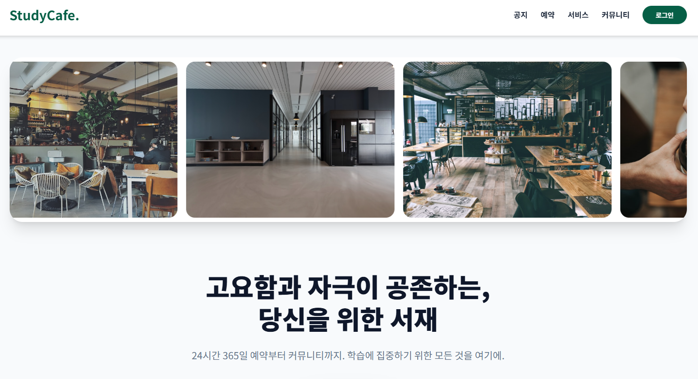
## 개발 목표
- 좌석 예약 과정을 단계별로 직관적으로 제공
- 결제 전 좌석 선점(홀드) 로직으로 중복 예약 방지
- 구독 여부에 따라 요금 정책을 다르게 적용
- 사용자 페이지와 관리자 페이지를 분리하여 운영 편의성 확보

## 기술 스택
### Backend
- Java 22
- Spring Boot 3.5.1
- Spring Data JPA
- Spring Security
- QueryDSL
- ModelMapper
- Spring Validation
- springdoc-openapi

### Frontend
- Thymeleaf
- HTML / CSS / JavaScript
- 정적 스크립트 기반 UI (`booking.js`, `mypage.js`, `news.js` 등)

### Database
- MariaDB

### External / Tools
- Toss Payments
- Gradle

## 주요 기능
### 1. 회원가입 / 로그인
- 회원가입 페이지 제공
- Spring Security 기반 로그인/로그아웃 처리
- 관리자(`/admin/**`, `/api/admin/**`) 접근 권한 분리

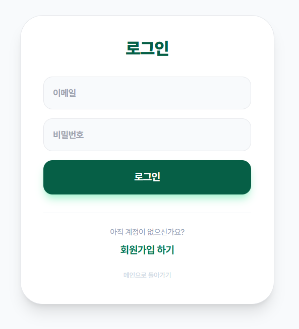
### 2. 좌석 예약
- 시간별 이용 요금 조회
- 날짜/시간/이용시간 기준 좌석 가용성 조회
- 예약 생성 시 좌석 홀드 및 결제 대기 상태 생성
- 예약 시작 시간 10분 단위 제한
- 과거 시간 예약 방지
- 마이페이지에서 예약 상태 확인

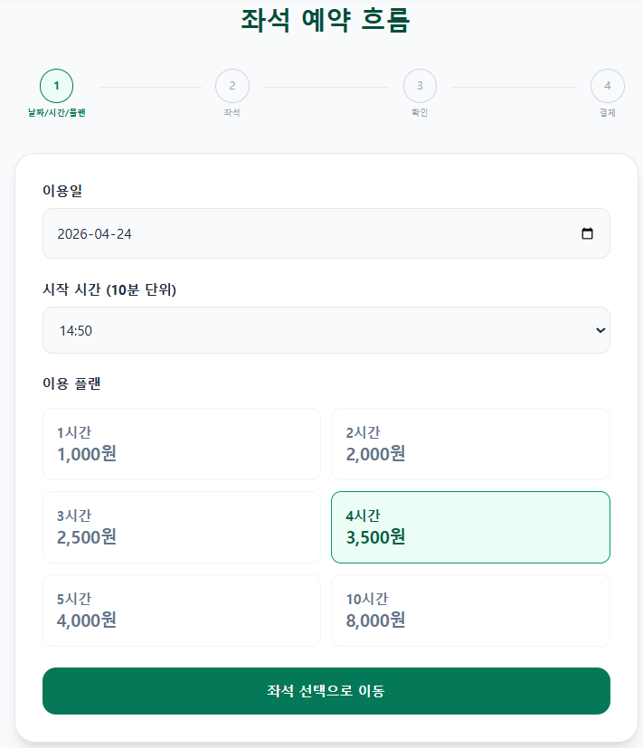
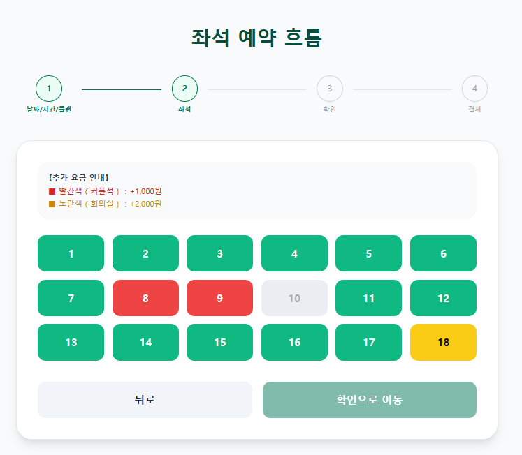
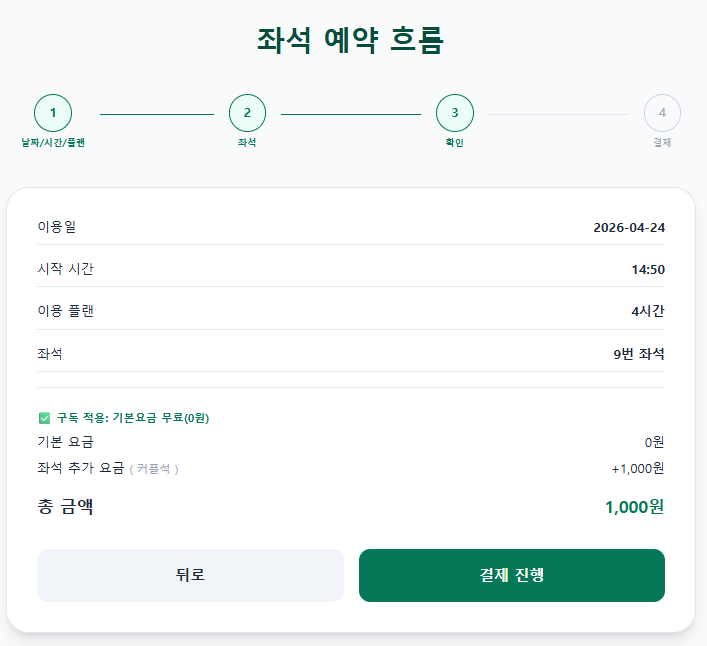
### 3. 결제
- 예약 결제 페이지 제공
- Toss Payments 연동
- 결제 성공/실패 콜백 처리
- 영수증 PDF 다운로드 기능 제공
- 임시 쿠폰 검증 API 제공

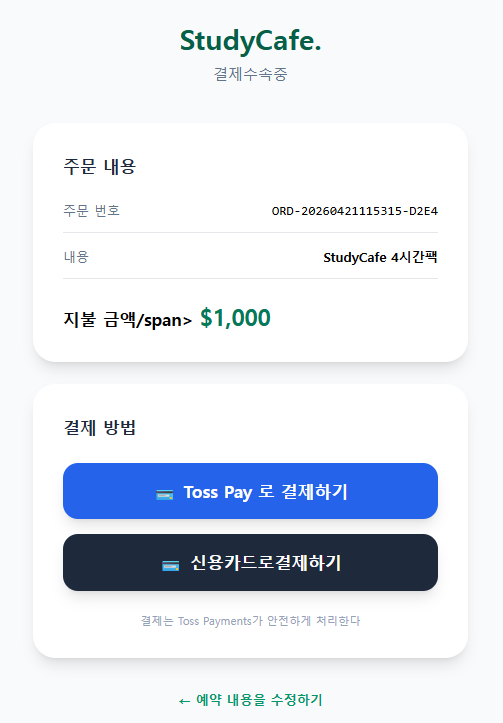
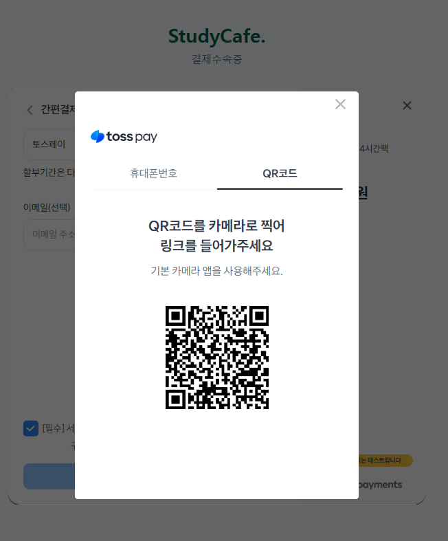
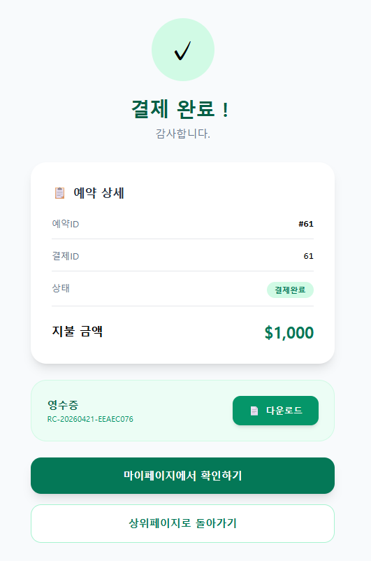
### 4. 구독 기능
- 구독 요금제 조회
- 구독 결제 생성 및 승인 처리
- 구독 활성 상태 조회
- 구독 사용자에게 기본 시간 요금 0원 적용

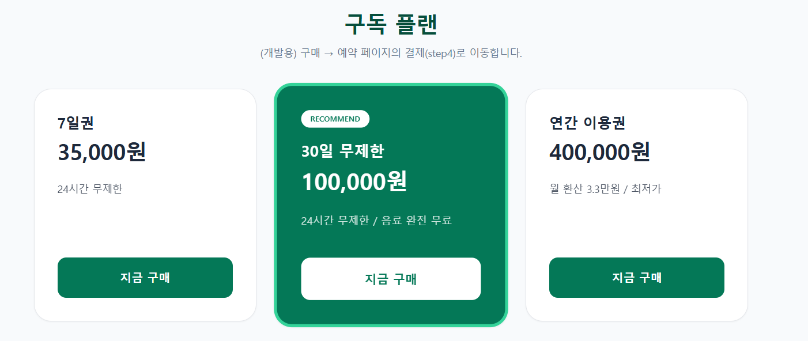
### 5. 커뮤니티
- 게시글 목록/등록/상세/수정/삭제
- 좋아요 기능
- 댓글 등록/삭제
- 인기 게시글 TOP3 노출

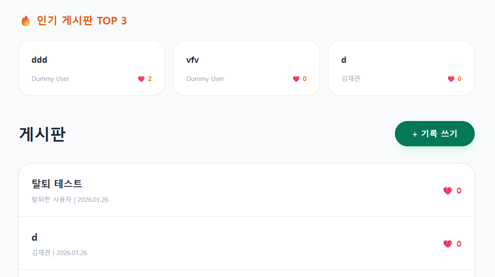
### 6. 고객 지원
- FAQ 조회
- 문의글 작성/수정/상세 조회
- 마이페이지에서 내 문의 내역 확인
- 공지사항 카테고리별 조회

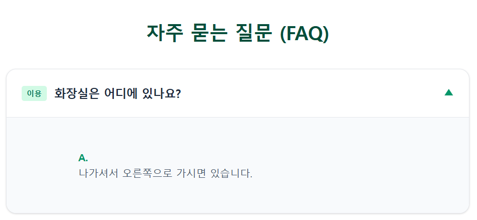
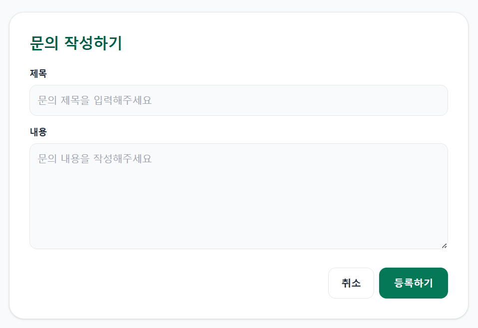
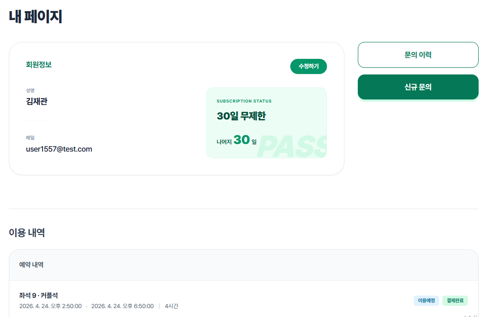
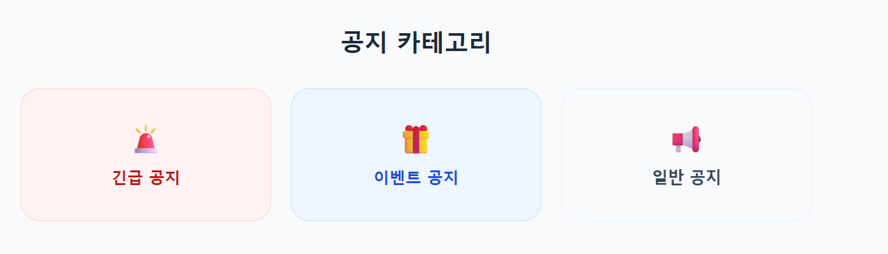
### 7. 관리자 기능
- 일자별 예약 현황 조회
- 회원 목록 / 검색 / 상세 조회
- 회원 활성화 상태 변경
- 문의 목록 / 상세 조회
- 관리자 전용 페이지 및 상태 스크립트 제공

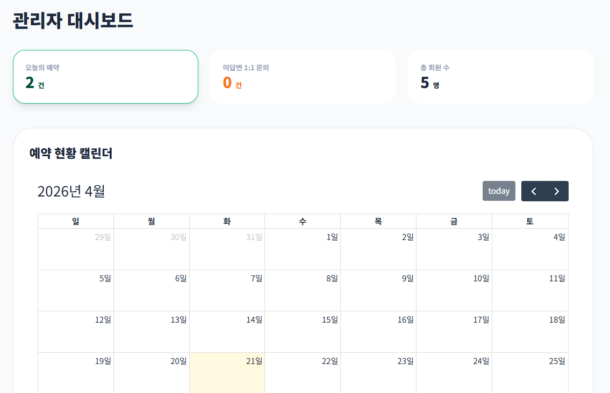
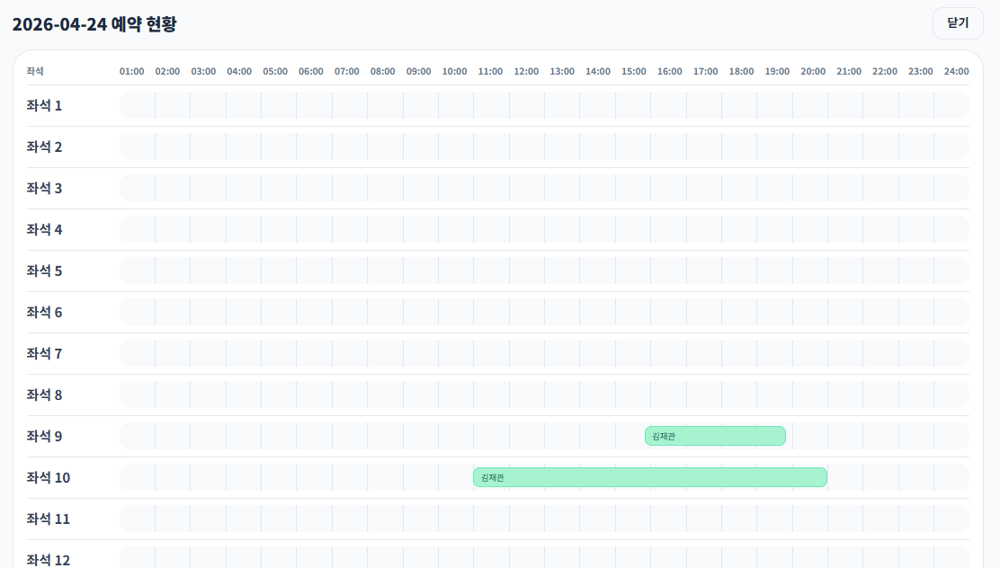
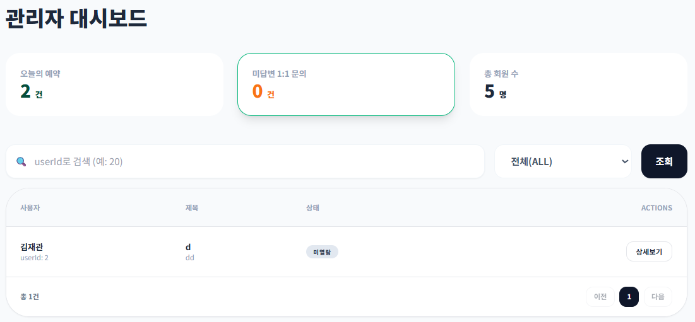
## 핵심 비즈니스 로직
### 예약 홀드 정책
예약 생성 시 즉시 확정되는 방식이 아니라, 일정 시간 동안 결제 대기 상태를 유지하는 홀드 방식을 사용합니다.
현재 코드 기준 결제 허용 시간은 **5분**이며, 결제가 완료되지 않으면 해당 좌석은 다시 예약 가능 상태로 돌아갑니다.

### 좌석 중복 예약 방지
동일 좌석에 대해 동시 예약이 들어오는 상황을 막기 위해 좌석 조회 시 잠금 기반 처리와 겹침 검사를 수행합니다.
이를 통해 결제 완료 건뿐 아니라 아직 결제 기한이 남아 있는 홀드 상태까지 점유 좌석으로 계산합니다.

### 구독 요금 정책
구독 사용자는 기본 시간 요금이 0원으로 처리되고, 좌석 추가요금만 결제하도록 설계되어 있습니다.

## 프로젝트 구조
```text
StudyCafe_Project/
├─ gradle/
├─ src/
│  ├─ main/
│  │  ├─ java/com/example/pentagon/
│  │  │  ├─ config/
│  │  │  ├─ controller/
│  │  │  │  ├─ admin/
│  │  │  │  ├─ advice/
│  │  │  │  └─ reservation/
│  │  │  ├─ domain/
│  │  │  │  ├─ community/
│  │  │  │  ├─ enums/
│  │  │  │  ├─ reservation/
│  │  │  │  └─ support/
│  │  │  ├─ dto/
│  │  │  ├─ repository/
│  │  │  └─ service/
│  │  └─ resources/
│  │     ├─ static/
│  │     │  ├─ admin/
│  │     │  └─ assets/js/
│  │     ├─ templates/
│  │     │  ├─ admin/
│  │     │  ├─ community/
│  │     │  ├─ payment/
│  │     │  └─ subscription/
│  │     └─ application.properties
│  └─ test/
├─ build.gradle
├─ settings.gradle
└─ gradlew
```

## 주요 도메인
- `User` : 회원 정보
- `Seat` : 좌석 정보
- `Reservation` : 예약 정보
- `Payment` : 결제 정보
- `Receipt` : 영수증 정보
- `Subscription` : 구독 정보
- `SubscriptionPrice` : 구독 요금제
- `TimePrice` : 시간별 이용 요금
- `Discount` : 할인 정보

## 주요 API 예시
### 예약
- `GET /api/time-prices`
- `GET /api/seats/availability?date=YYYY-MM-DD&time=HH:mm&hours=n`
- `POST /api/reservations`
- `POST /api/reservations/{id}/payment`
- `GET /api/reservations/me`
- `POST /api/reservations/{id}/pay-success`

### 결제
- `GET /booking/payment`
- `POST /api/reservations/payment`
- `POST /api/payments/toss/confirm`
- `POST /api/payments/refund`
- `GET /api/receipts/{receiptId}`

### 구독
- `GET /api/subscription-plans`
- `POST /api/subscription-payments`
- `POST /api/subscription-payments/toss/confirm`
- `GET /api/subscriptions/me`

### 커뮤니티
- `GET /community`
- `POST /community/register`
- `GET /community/read/{id}`
- `POST /community/like`
- `POST /community/comment/register`

### 관리자
- `GET /api/admin/reservations/day?date=YYYY-MM-DD`
- `GET /api/admin/users`
- `GET /api/admin/users/search?keyword=...`
- `GET /api/admin/users/detail/{id}`
- `PUT /api/admin/users/{id}/active?active=true|false`

## 실행 방법
### 1. 프로젝트 클론
```bash
git clone https://github.com/kimjaegwan0218/StudyCafe_Project.git
cd StudyCafe_Project
```

### 2. DB 준비
MariaDB에서 사용할 데이터베이스를 생성합니다.

```sql
CREATE DATABASE webdb;
```

### 3. `application.properties` 설정 확인
기본 설정은 `localhost:3306/webdb`, 포트 `8081` 기준입니다.
환경에 맞게 DB 계정, 비밀번호, Toss 키를 수정하세요.

예시:
```properties
spring.datasource.url=jdbc:mariadb://localhost:3306/webdb
spring.datasource.username=YOUR_DB_USER
spring.datasource.password=YOUR_DB_PASSWORD
server.port=8081
```

### 4. 실행
```bash
./gradlew bootRun
```

Windows에서는:
```bash
gradlew.bat bootRun
```

### 5. 접속
```text
http://localhost:8081
```

## 트러블슈팅 포인트로 강조할 만한 부분
### 1. 중복 예약 방지
예약 시스템에서 가장 중요한 문제는 같은 좌석이 같은 시간대에 중복 예약되는 상황입니다.  
이 프로젝트는 좌석 잠금과 겹침 검사를 통해 이를 방지하도록 설계되어 있습니다.

### 2. 결제 대기 시간 관리
결제 창으로 이동한 뒤 결제가 완료되지 않는 경우, 좌석을 무한정 점유시키면 실제 사용자가 예약을 못 하게 됩니다.  
이를 해결하기 위해 홀드 시간을 두고 자동으로 점유 상태에서 해제되도록 처리했습니다.

### 3. 구독자 요금 정책 반영
단순히 결제 화면에서만 0원 처리하는 것이 아니라, 서버에서도 구독 여부를 다시 검증하여 기본요금을 0원으로 적용하는 구조를 사용했습니다.

## 개선해볼 수 있는 점
- `application.properties`의 민감 정보(DB 계정, 결제 키)를 환경변수로 분리
- README에 ERD 이미지, 화면 캡처, 시연 GIF 추가
- 테스트 코드 및 API 문서(Swagger 화면) 캡처 보강
- 배포 환경 설정 및 운영용 프로파일 분리
- 예외 처리 및 사용자 메시지 정리

## 회고
이 프로젝트는 단순한 예약 페이지를 넘어서,  
**회원 관리 + 예약 + 결제 + 구독 + 커뮤니티 + 관리자 기능**을 하나의 서비스 흐름으로 연결한 점이 강점입니다.
특히 예약/결제/구독 로직처럼 상태 관리가 중요한 기능을 직접 구현해보며 실서비스에 가까운 흐름을 경험할 수 있는 프로젝트입니다.
